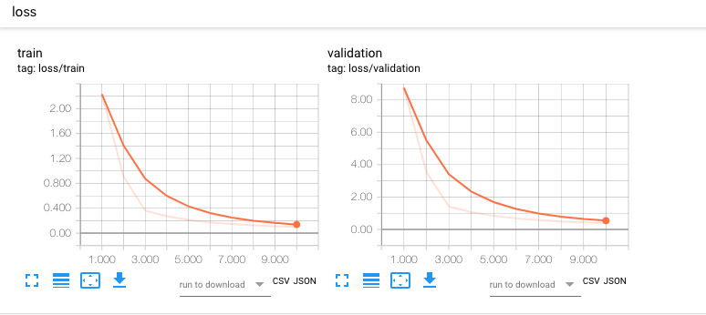
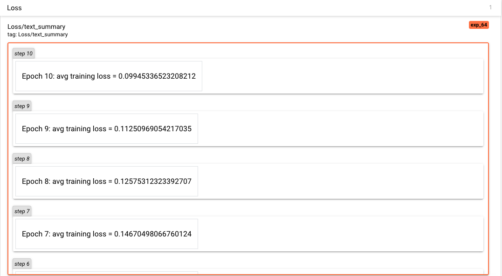
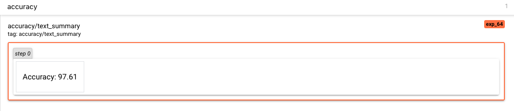
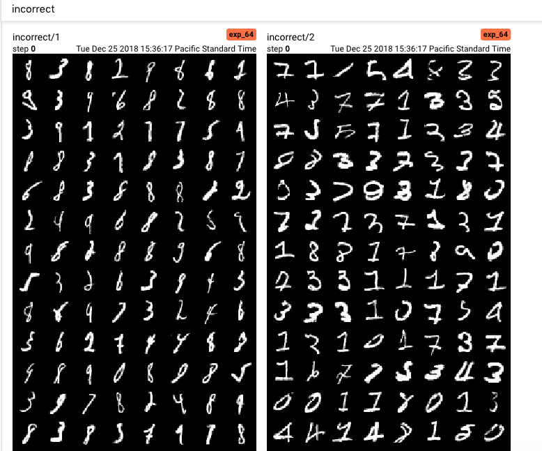

# tensorboardx-experiment

A simple script to explore the abilities of TensorboardX. The script creates a simple convolutional neural net and trains it sending events to be logged to TensorboardX.

## Usage ##
Set up the required environment 
```
conda env create -f environment.yml 
```

Activate the environment
```
conda activate tensorboardx-experiment
```

Start Tensorboard
```
tensorboard --logdir=runs/
```

Run the script
```
python tensorboard_demo.py 
```

## Screenshots ##
Visualizing training and validation loss over number of epochs


Logging average loss per epoch and accuracy



Visualizing incorrect predictions

